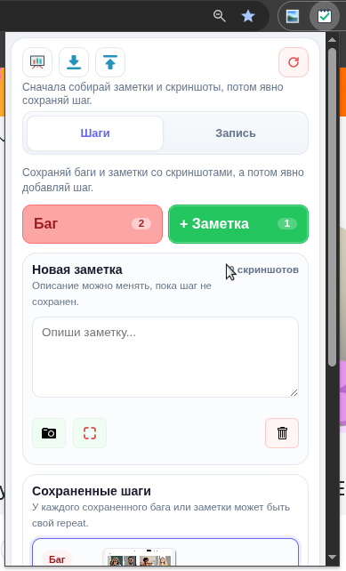
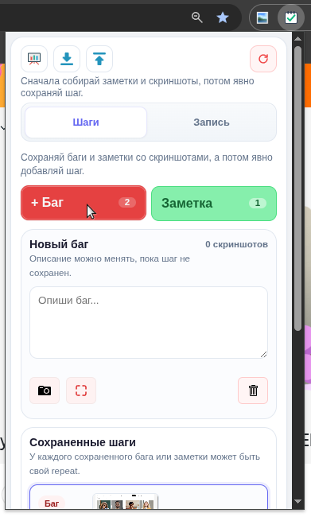
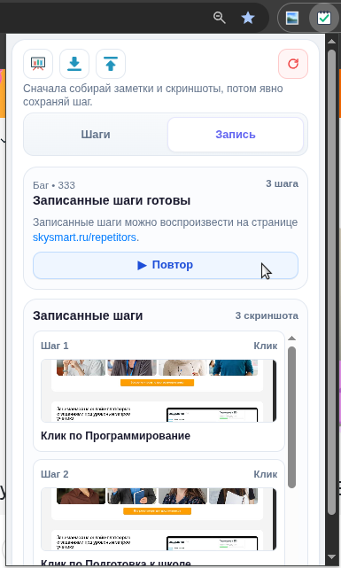
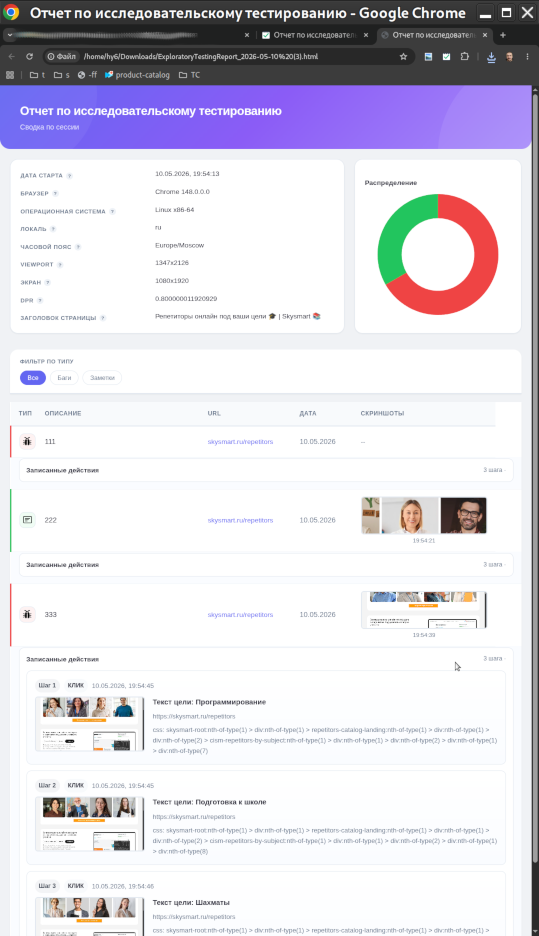
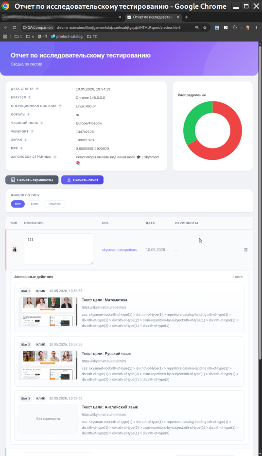

# QA Companion

QA Companion is a Chrome extension for exploratory testing sessions with notes, multiple screenshots, and lightweight reporting.

## Features

- Create annotations as `Bug` or `Note`
- Keep a draft in the popup and save a step explicitly
- Attach multiple screenshots to one step
- Edit saved descriptions in the report
- Remove individual screenshots from saved steps
- Export and import sessions
- Export session data to JSON or HTML

## Screenshots

### Action notes

Capture and save exploratory testing notes with a focused popup flow.



Create bug annotations with screenshots attached to the same draft.



### Recorder

Record a flow step by step and keep screenshots linked to recorded actions.



### Reports and review

Review saved session data in the HTML report after the session is complete.



Inspect the live view with captured steps and screenshots together.



## Origin

This project is based on the original Exploratory Testing Chrome Extension by `morvader`:
- Chrome Web Store: <https://chrome.google.com/webstore/detail/exploratory-testing-chrom/khigmghadjljgjpamimgjjmpmlbgmekj>
- Source repository: <https://github.com/morvader/ExploratoryTestingChromeExtension>

Change history for this fork: `CHANGELOG.md`

## Local setup

Install dependencies:

```bash
npm install
```

Then load the extension as unpacked in Chrome/Chromium from this folder.

Note: for Yandex Browser go to `browser://extensions/`
